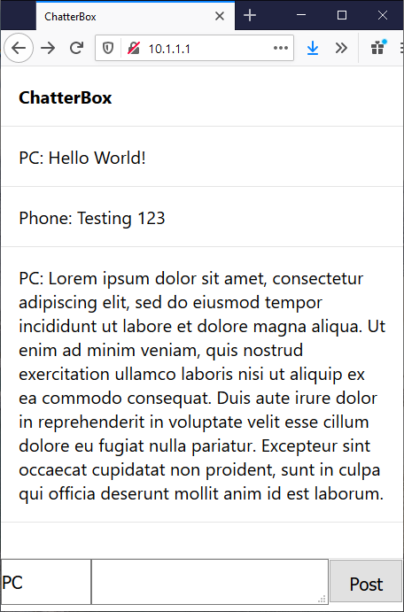

# ESP32 ChatterBox

Turn your ESP32 into a public signing board anybody can leave messages on.

The UI is simple and looks like this

## Compiling

Refactored to use PlatformIO. The included platformio.ini file is configured for the Sparkfun ESP32thing. Change it to whatever board you are using.

To customize the HTML code, edit the included index.html, and then use build-html.js to convert it to HTMLPAGE.h

Run: `node build-html.js`

## Usage

Connect to the ESP32 over wifi (AP name "ChatterBox"), then navigate to http://10.1.1.1

From there, you can set a username and leave messages. 

There is an OTA Web update page at `http://10.1.1.1/update`

If you want to clear all the messages, connect over serial (115200 baud) and send a lowercase `c`. You can also browse to `http://10.1.1.1/clear` in a browser.

All messages can be read out over serial by sending a lowercase `r`.

A SPIFFS file browser can be viewed at `http://10.1.1.1/browse`. Each file is linked, but file downloads are not functional at this time. Maybe in the next update.

## Fixed

The original code I forked this from had a bug where the code would only run once until the ESP32 was reset, then any new client connections would crash and restart the ESP32. I worked around this bug by implementing some suggestions from [this issue](https://github.com/espressif/arduino-esp32/issues/2025)